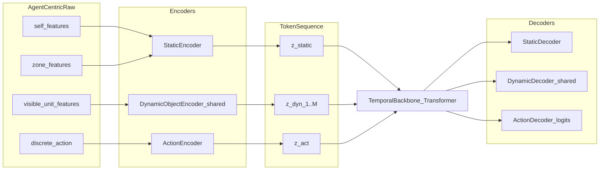
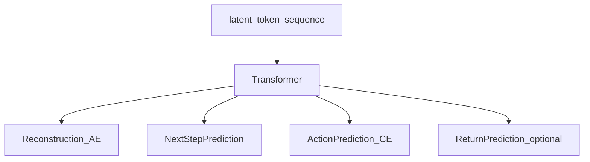

# TABX Offline 序列数据与 Agent 中心转换说明

本文整理「以环境为中心」的 offline 轨迹存储方案，以及如何对照现有 RL 观测接口转换成「以 agent 为中心」的序列，并说明 obs/action 的离散性与 OmniRL 词表化可行性。

**实现入口**（采集 + 拆分）：[`generate/`](../generate/)，说明见 [`generate_record.md`](generate_record.md)。

参考实现主要位于：

- [`generate/`](../generate/)：env-centric 并行采集、agent-centric 拆分
- [`src/tabx/tabx.py`](../src/tabx/tabx.py)：`get_obs` / `step` / `get_avail_actions` / `world_state`
- [`src/tabx/constants.py`](../src/tabx/constants.py)：`UnitAction` / `ACTION_TABLE`
- [`src/tabx/wrappers/wrappers.py`](../src/tabx/wrappers/wrappers.py)：敌方 heuristic、ally reward 过滤
- [`src/baseline/marl_baseline.py`](../src/baseline/marl_baseline.py)：当前 RL 如何消费 obs/action
---

## 1. 环境为中心：每个 step 建议保存什么

目标是先落盘完整、可复现的全局轨迹；后续再投影成 agent-centric 序列，而不是只存当前 RL 的扁平向量。

### 1.1 推荐的一步（transition）结构

```text
Transition_t = {
  meta,
  units,          # 全局单位状态（绝对坐标）
  zones,          # 全局 zone 状态
  actions,        # 全体单位动作（含 enemy / disabled）
  rewards,        # team / agent 级 reward
  dones,
  info,
  derived         # 可选：visible_matrix / attackable_matrix / world_state
}
```

### 1.2 字段清单

| 字段 | 建议内容 | 说明 |
|---|---|---|
| `meta.task_id` / `seed` / `timestep` | 任务与时间索引 | 与 task bank、复现对齐 |
| `meta.max_n_ally/enemy/zone` | schema padding | 与 task bank schema 一致 |
| `units.unit_key` | `ally_0..` / `enemy_0..` | 稳定 agent id |
| `units.unit_id` | 单位类型 ID（1–9） | Farmer/Assassin/... |
| `units.team` | `0/1` | ally/enemy |
| `units.position` | `(x, y)` 绝对坐标 | **连续** |
| `units.rotation` | 朝向角（rad） | **连续**；obs 里常归一化为 `/ 2π` |
| `units.health` / `max_health` | HP | **连续** |
| `units.speed` / `max_speed` | 速度 | **连续** |
| `units.attack_damage/range/cooldown` | 战斗规格 | 可当离散类别或连续属性 |
| `units.cooldown` | 当前 CD | **连续/可离散** |
| `units.body_radius` / `body_weight` | 物理规格 | **连续** |
| `units.sight_angle` | FOV 张角 | 默认 `π/2` |
| `units.attack_type` | `DEFAULT/HEALING` | **离散** |
| `units.is_alive` / `is_disabled` | 存活/占位 padding | **离散** |
| `zones.zone_type` | lava/bush/swamp/empty | **离散** |
| `zones.position` / `axes` / `effect_value` | 椭圆参数 | 位置/尺寸为连续 |
| `actions[agent]` | `{0..7}` | **离散**，见下文动作表 |
| `avail_actions[agent]` | shape `(8,)` bool/0-1 | ATTACK 受 CD 约束 |
| `rewards.team` | shape `(2,)` | 环境原生 team reward |
| `rewards.agent` | 每个可控单位同队 reward | RL wrapper 通常把 team0 reward 广播给 ally |
| `dones[agent]` / `dones.__all__` | 单位死/整局结束 | truncation 也会置 `__all__` |
| `info.timestep` / `is_win` / `truncation` / `damage_dealt` / `is_attacking` | 诊断与标签 | 训练序列建议保留 |
| `derived.visible_matrix` | `(N,N)` FOV 可见性 | 便于离线重算局部观测 |
| `derived.attackable_matrix` | `(N,N)` hurtbox 可交互 | 攻击/治疗合法性 |
| `derived.world_state` | 扁平全局向量（可选） | 与 MAPPO critic 对齐，但不建议当唯一存盘格式 |

### 1.3 为什么优先存结构化全局状态，而不是只存 `world_state`

现有 `world_state`（`world_state_type="global"`）是：

```text
concat(all units' 14-d features) + zone_world_feature
```

它适合 MAPPO critic，但：

1. 丢失了「谁看见谁」的可见性矩阵；
2. 相对坐标/局部遮罩无法无损还原；
3. padding、单位顺序、阵营翻转后难做统一 tokenization。

**建议主存：结构化 `units/zones/actions`；附带存 `visible_matrix` 与扁平 `world_state` 以便对齐现有 RL。**

### 1.4 Reward 语义（存盘时建议同时保留）

环境 `step` 先产出 **team-level** reward：

- **Dense**：双方平均 HP 比例差的变化（`delta_hp`）
- **Terminal**：分出胜负时胜方 `+1`、败方 `-1`；超时按更高平均 HP 判胜，平局偏向对手

经 `TABXEnemyHeuristicWrapper` 后，训练侧通常只把 **ally team reward** 广播给每个 ally agent。  
Offline 序列建议同时保存：

- `reward_team[2]`
- `reward_ally_shared`（team0）
- 可选：未来自定义的 per-agent shaped reward

---

## 2. 现有 RL 观测是什么（对照基线）

### 2.1 Action：已是离散

`UnitAction` / `ACTION_TABLE` 定义 **8** 个离散动作（代码为准；README 写 6 已过时）：

| id | 名称 | 语义 |
|---:|---|---|
| 0 | `UP` | +y 移动 |
| 1 | `DOWN` | -y 移动 |
| 2 | `LEFT` | -x 移动 |
| 3 | `RIGHT` | +x 移动 |
| 4 | `ATTACK` | 朝向 hurtbox 攻击/治疗（CD 未好则 `avail=0`） |
| 5 | `TURN_RIGHT` | 右转 `π/6` |
| 6 | `TURN_LEFT` | 左转 `π/6` |
| 7 | `IDLE` | 不动 |

空间类型：`Discrete(n=8)`。  
**OmniRL 可直接做成大小为 8 的动作词表（可再加 PAD/MASK）。**

### 2.2 Observation：连续 Box，不是离散

每个 agent 的局部 obs 是 `Box(low=-1, high=1, shape=(...), float32)`，拼接为：

```text
obs_i = [own_feature(14d), other_feature(16d × (N-1)), zone_feature(6d × max_n_zone)]
```

**own_feature（自身，14 维）：**

```text
health,
health / max_health,          # 注意：不是绝对 max_health；ParsedState 字段名易误导
abs_x, abs_y,                 # 世界绝对坐标
rotation / 2π,
attack_range, attack_damage,
cooldown,                     # 当前冷却累计
cooldown / attack_cooldown,   # 冷却进度比
body_radius, body_weight,
sight_angle / 2π, is_alive, speed
```

**other_feature（其他单位 × (N−1)，每槽 16 维；不可见则整段置 0）：**

```text
health,
health / max_health,
rel_x, rel_y,                 # 世界系差分 pos_other - pos_self（不是朝向局部系）
rotation / 2π,
attack_range, attack_damage,
cooldown, cooldown / attack_cooldown,
body_radius, body_weight,
sight_angle / 2π, is_alive,
is_ally, is_attackable, speed
```

**zone_feature（与 FOV 无关，始终给出；空 zone 被 mask）：**

```text
zone_type, rel_x, rel_y, axis_a, axis_b, effect_value
```

默认 schema `max_n_ally/enemy/zone = 10/10/4` 时，单 agent obs dim ≈  
`14 + 16×19 + 6×4 = 342`。

局部 obs **不含** `unit_id`、`attack_type`、`timestep`、速度向量等；这些只在完整 `env_state` 里。  
`world_state`（critic 用）是全局扁平向量，不等价于单个 agent 的局部 obs。  
字段解析可对照 [`src/tabx/heuristic_policy/components.py`](src/tabx/heuristic_policy/components.py) 的 `OwnState` / `OtherState`。

---

## 3. 局部观测如何构建：FOV，不是 KNN

结论先说：

> **现有 TABX RL 观测是「扇形视野（fan-shaped FOV）遮罩」+「全量其他单位槽位」；不是 KNN，也没有显式最大视距截断。**

### 3.1 可见性规则

1. **角度扇区**：以单位朝向为中心、张角 `sight_angle`（默认 `π/2`）形成扇形；落在扇内则 `visible_matrix=True`。
2. **不是 top-k / KNN**：不可见单位仍占固定槽位，特征被乘 0。
3. **没有单独的 max sight range**：可见性是「无限远扇形楔」+ body_radius 容差，再叠加 bush 规则；攻击范围是另一套 `attackable_matrix`（朝向局部系下的矩形 hurtbox）。
4. **Zone 不走 FOV**：zone 信息始终拼进 obs（空 zone type=0 被清零）。
5. **Bush 额外规则**：草丛隐身、同草互见、攻击暴露等，会在 FOV 结果上再修正 `visible_matrix`。
6. **相对坐标是世界系差分**，不是把他人变换到自身朝向坐标系；朝向局部坐标只用于 hurtbox 判定，不进入 obs。

因此「agent-centric 局部观测」=  
**在全局状态上，按每个 agent 的朝向扇区 + bush 规则做 mask，再写成世界系相对坐标特征。**

### 3.2 环境中心 → Agent 中心：建议转换流程

给定已存的全局轨迹 `units_t, zones_t, visible_matrix_t`：

```text
for each agent i in controllable units:
  1. 取 own 绝对特征 → own_feature
  2. 对其余单位 j:
       if visible_matrix[i, j]:
           写 relative (pos_j - pos_i)、属性、is_ally、is_attackable
       else:
           写全 0（保持槽位对齐）
  3. 对每个 zone:
       写 (type, pos_zone - pos_i, axes, effect)
  4. 得到 obs_i,t  （与 TABX.get_obs 对齐）
  5. 动作 a_i,t 直接取全局 actions[i]
  6. reward_i,t 取 team reward（或自定义）
```

实现上优先 **复用** `TABX.get_obs(state)` / `update_distance_matrix()`，避免手写 FOV 与官方不一致。

### 3.3 若未来要做 KNN 变体（可选，不是现状）

现状不是 KNN。若 OmniRL/序列模型想要更紧凑输入，可在离线转换层新增：

| 方案 | 做法 | 与现状差异 |
|---|---|---|
| A. FOV mask（默认，对齐 RL） | 扇形可见才填特征 | 与现网一致 |
| B. FOV + 距离截断 | 扇形 ∩ 半径 R | 需新增超参 R |
| C. KNN-k | 取最近 k 个可见单位 | 槽位数变短，需重训 |
| D. 全局无遮罩 | 全知状态 | 仅适合 oracle / 分析 |

**第一期建议只做 A，保证与现有 MARL 观测一致；B/C 作为 ablation。**

---

## 4. 离散性与 OmniRL 词表化

### 4.1 结论总表

| 模态 | 原生类型 | 能否直接词表化 | 建议 |
|---|---|---|---|
| Action | `Discrete(8)` | 是 | 直接 token：`A0..A7`，外加 `PAD/MASK` |
| Avail mask | 0/1 × 8 | 是 | 非法动作 mask 或特述 token |
| Unit type / team / alive / attack_type / zone_type | 离散小词表 | 是 | 类别嵌入 |
| Position / rotation / HP / cooldown / speed 等 | 连续 float | 否（需量化） | 分箱 / μ-law / VQ / 相对网格 |
| Local obs 向量 | 连续 `Box` | 否 | 拆成「离散字段 + 量化连续字段」再序列化 |
| Reward | 连续标量 | 通常量化或回归头 | OmniRL 可分箱 reward token |

### 4.2 Action：天然适合 OmniRL

动作本身已是小词表。序列可写成：

```text
... [OBS tokens of agent i] [ACT a_i] [REW r_bin] ...
```

或环境中心时间片：

```text
[GLOBAL_STATE tokens] [ACT_ally0] ... [ACT_allyN] [REW]
```

### 4.3 Observation：两条路——硬离散，或 encoder 压成 latent token

当前 RL 直接吃 float32 Box，**没有官方离散观测词表**。

**路径 A：硬离散词表**（OmniRL 检索式接口直接可用，但 token 数易膨胀）：

1. **结构性字段先离散**  
   `unit_id, team, is_alive, is_ally, is_attackable, zone_type, attack_type`
2. **几何/数值字段再量化**  
   - 位置：地图范围归一化后均匀分箱，或相对坐标分箱  
   - 朝向：`rotation` 按 `TURN_ANGLE=π/6` 或更细 bins  
   - HP：按 `health/max_health` 分位数/均匀箱  
   - cooldown：按 `cooldown/attack_cooldown` 分箱
3. **保持与 FOV mask 一致**  
   不可见单位用特殊 `UNSEEN` token，而不是随机噪声箱
4. **固定槽位 vs 变长集合**  
   - 对齐现有 RL：固定 `N-1` 个 other slots + `max_n_zone`  
   - OmniRL 也可改成变长 token 集合（仅输出可见实体），但那是新接口，不再等价于现网 obs

**路径 B：连续 latent token（推荐）**：用 Static / Dynamic encoder 压成少数 `z_*`，不必整词表；见 **第 6 节**。需要离散时再对 latent 做 VQ。

### 4.4 环境中心序列如何服务两类训练

```text
Env-centric offline dump
        │
        ├─(A) 直接喂全局序列模型 / world model
        │     tokens ≈ units + zones + joint actions
        │
        └─(B) 投影成 Agent-centric
              复用 FOV mask / relative features
              对齐现有 IPPO/MAPPO/QMIX 与未来 OmniRL agent policy
```

---

## 5. 建议的落盘与转换优先级

### Phase 0（现在就定）

1. 以 **结构化全局状态** 存 offline 序列（第 1 节字段）。
2. 同步存 `actions(all units)`、`rewards.team`、`dones`、`info`、`visible_matrix`。
3. 可选 cache：`world_state`、`agent_obs`（便于立刻对齐现有 RL）。

### Phase 1（做序列模型 / OmniRL）

两条可选路径（可并行探索）：

1. **离散词表路径**：Action 8 类直接词表化；Obs 分箱 + `UNSEEN`（见第 4 节）。
2. **连续 latent token 路径（推荐缓解 token 爆炸）**：静态/动态双 encoder 压缩观测，动作 encoder 出 `a_token`；配套 decoder 重建/预测，不必强行整词表（见第 6 节）。

转换器：`env_centric_step -> agent_centric features`，内部复用 `get_obs` 的 FOV 逻辑，再送入 encoder。

### Phase 2（可选消融）

1. FOV+距离截断、KNN-k、全知全局三种观测变体。
2. 比较「固定槽位 obs」与「变长实体 token 序列」。
3. 比较「纯离散词表」vs「连续 latent token」vs「latent + VQ 二次离散」。

---

## 6. 连续 Latent Token 方案（缓解每步 token 过多）

### 6.1 结论：可行

**可行，而且更契合 TABX 的观测结构。**

全特征离散分箱会导致每步 token 数爆炸（自身 + 可见单位 × 多字段 + zone × 多字段）。更合适的做法是：

```text
原始连续/类别特征
  → Encoder 压成少数 d 维 latent（当作 soft token）
  → 时序骨干（Transformer 等）在 token 序列上建模
  → Decoder 重建观测 / 预测下一观测 / 解出动作分布
```

这样：

- **不必**先做巨型离散词表；
- 仍保持「一个实体 ≈ 一个 token」的集合语义；
- 动作本身已是 8 类离散，可直接 embed，也可用小 encoder 映到同维度 `a_token`；
- 以后若要接 OmniRL 式离散接口，可对 latent 再做 VQ，而不必从原始高维特征硬分箱。

### 6.2 观测拆分（对齐 TABX）

以 **agent-centric** 一步为例：

| 类型 | 内容（TABX） | Token 设计 |
|---|---|---|
| **Static** | 自身状态 + 全部 zone（zone 本就不走 FOV） | 1 个 `z_static`（或 self / zone 再拆成 2 个） |
| **Dynamic** | FOV 内可见友军/敌军（`visible_matrix`） | 变长：`z_dyn_1 … z_dyn_M`，每可见单位 1 token |
| **Action** | 自身离散动作 `a ∈ {0..7}` | 1 个 `z_act`（embedding 或小 MLP） |
| **Reward（可选）** | `r_team` / `r_j` | 1 个标量投影，或仅作训练标签不进序列 |

推荐一步序列形态：

```text
[ z_static_t , z_dyn_t,1 , … , z_dyn_t,M_t , z_act_t ]  (+ 可选 z_rew_t)
```

不可见单位 **不生成 token**（变长），比固定 `N-1` 槽全填 0 更省。

### 6.3 框架图



训练时常见目标（可组合）：



### 6.4 伪代码

```python
# ---------- feature packing (from env-centric dump) ----------
def pack_agent_step(global_t, agent_i):
    self_f = own_features(global_t, agent_i)          # continuous + small categoricals
    zone_f = zone_features_relative(global_t, agent_i)  # always included
    dyn_list = []
    for j in units_except(agent_i):
        if visible(global_t, agent_i, j):             # FOV (+ bush), not KNN
            dyn_list.append(other_features_rel(global_t, agent_i, j))
    a = action[agent_i]                               # int in [0, 7]
    r = reward_agent[agent_i]                         # label; optional in sequence
    return self_f, zone_f, dyn_list, a, r


# ---------- encoders / decoders ----------
class StaticEncoder(nn.Module):
    def __call__(self, self_f, zone_f):
        x = concat([self_f, flatten(zone_f)])
        return MLP(x)                                 # -> [D]

class DynamicObjectEncoder(nn.Module):
    """Shared across all visible units."""
    def __call__(self, unit_f):
        # unit_f may include: rel_xy, hp_ratio, is_ally, is_attackable, specs...
        return MLP(unit_f)                            # -> [D]

class ActionEncoder(nn.Module):
    def __call__(self, a):
        return Embed(num_actions=8, D)(a)             # or MLP(one_hot(a))


class StaticDecoder(nn.Module):
    def __call__(self, z):
        return head_self(z), head_zones(z)            # reconstruct continuous fields

class DynamicDecoder(nn.Module):
    def __call__(self, z):
        return head_unit(z)                           # reconstruct one object

class ActionDecoder(nn.Module):
    def __call__(self, z_ctx):
        return logits_8(z_ctx)                        # CE over discrete actions


# ---------- encode one step ----------
def encode_step(self_f, zone_f, dyn_list, a, enc_s, enc_d, enc_a):
    tokens = [enc_s(self_f, zone_f)]
    for u in dyn_list:
        tokens.append(enc_d(u))
    tokens.append(enc_a(a))
    # optional type embeddings: STATIC / DYN / ACTION
    return stack(tokens)                              # [1+M+1, D]


# ---------- sequence model ----------
def loss_on_trajectory(steps, model):
    all_tokens, segment_ids = [], []
    for t, step in enumerate(steps):
        tok = encode_step(*step.raw, *model.encoders)
        all_tokens.append(tok)
        segment_ids.append(full(tok.shape[0], t))
    x = concat(all_tokens, axis=0)                    # variable length
    h = Transformer(x, key_padding_mask=...)

    # example objectives
    L_rec = recon_static(h, steps) + recon_dynamic(h, steps)
    L_act = cross_entropy(action_decoder(h_at_obs_tokens), actions)
    L_next = predict_next_latent(h, encode_step(steps[t+1]))  # optional
    return L_rec + L_act + L_next
```

### 6.5 设计要点

1. **Dynamic encoder 权重共享**：所有可见单位共用 `DynamicObjectEncoder`，用 `is_ally` 等字段区分敌我，而不是敌/友两套大网。
2. **变长序列 + mask**：`M_t` 随 FOV 变化；padding 到 `max_visible` 仅为了 batch，loss 里 mask 掉 pad。
3. **Token type embedding**：`STATIC / DYN / ACT / REW`，避免三类向量混同。
4. **动作**：环境动作已是离散 8 类——`ActionEncoder=Embedding(8,D)` 通常足够；decoder 用 CE。不必把动作再连续化。
5. **Reward**：训练标签可继续用 `r_team` / 个体 shaping；是否把 `z_rew` 编进序列取决于你是否做 return-conditioned 生成。
6. **与词表路线关系**：
   - 现在：连续 latent soft-token，无词表；
   - 以后：对 `z_*` 做 VQ-VAE / FSQ，得到真正离散 code，再接 OmniRL 检索式接口。
7. **每步 token 预算（粗算）**：`1 static + M visible + 1 action`。若 `M≈0–8`，每步约 **2–10** 个 token，远小于「每字段一 token」的分箱方案。

### 6.6 和全离散词表的取舍

| | 全离散分箱 | 连续 latent token（本节） |
|---|---|---|
| 每步长度 | 很容易几十～上百 | `O(可见单位数)` |
| 词表 | 必须维护多字段 bins | 非必须 |
| 训练 | CE / 检索友好 | AE+CE / 回归；可加 VQ 后离散化 |
| 与 TABX FOV | 需大量 `UNSEEN` 槽 | 不可见直接不建 token |
| OmniRL 兼容 | 直接 | 先 latent，必要时再 VQ |

---

## 7. 一句话结论

- **每个 step 先以环境为中心存**：全体单位/zone 的绝对状态 + 全体动作 + team reward/done/info，并建议附带 `visible_matrix`。  
- **转 agent 中心时**：按现有实现做 **扇形 FOV 遮罩（非 KNN、无显式视距）**，相对坐标填充可见单位，zone 始终相对给出。  
- **动作已是 8 类离散**；观测若强行全分箱会导致 token 爆炸。更推荐 **Static / Dynamic 双 encoder + Action encoder** 压成少量连续 latent token，并用 decoder 重建/预测；需要词表时再对 latent 做 VQ，而不是从原始高维 obs 硬离散化。
